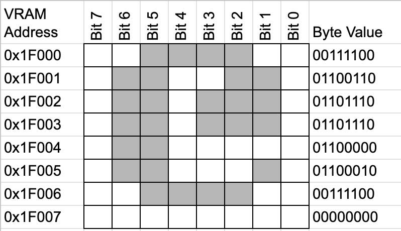

# Tiles
Most games will use tile mode so we will start by looking at how this works. The CX16 actually has a tileset already loaded in VRAM when you start the emulator. The characters for displaying text! Yes, the characters you see on the screen are just tiles. The default tileset includes all of the PETSCII characters (letters, numbers, symbols, etc.) The editor you start in can translate characters to tile indexes. In this chapter we will start by examining these tiles and how they are displayed on the screen. We will then make some of our own tiles.

## State of the Emulator When it Starts
When you start the emulator (and starting a real CX16 _should_ be the same), it has a default state. Let's go through some of it. Here are the registers we will look at:

<table>
<thead>
    <tr>
		<th>Addr</th>
		<th>Name</th>
		<th>Bit&nbsp;7</th>
		<th>Bit&nbsp;6</th>
		<th>Bit&nbsp;5 </th>
		<th>Bit&nbsp;4</th>
		<th>Bit&nbsp;3 </th>
		<th>Bit&nbsp;2</th>
		<th>Bit&nbsp;1 </th>
		<th>Bit&nbsp;0</th>
	</tr>
</thead>
<tbody>
	<tr>
		<td>0x9F29</td>
		<td>DC_VIDEO (DCSEL=0)</td>
		<td colspan="1" align="center">Current Field</td>
		<td colspan="1" align="center">Sprites Enable</td>
		<td colspan="1" align="center">Layer1 Enable</td>
		<td colspan="1" align="center">Layer0 Enable</td>
		<td colspan="1" align="center">NTSC/RGB: 240P</td>
		<td colspan="1" align="center">NTSC: Chroma Disable / RGB: HV Sync </td>
		<td colspan="2" align="center">Output Mode</td>
	</tr>
	<tr>
		<td>0x9F34</td>
		<td>L1_CONFIG</td>
		<td colspan="2" align="center">Map Height</td>
		<td colspan="2" align="center">Map Width</td>
		<td colspan="1" align="center">T256C</td>
		<td colspan="1" align="center">Bitmap Mode</td>
		<td colspan="2" align="center">Color Depth</td>
	</tr>
	<tr>
		<td>0x9F35</td>
		<td>L1_MAPBASE</td>
		<td colspan="8" align="center">Map Base Address (16:9)</td>
	</tr>
	<tr>
		<td>0x9F36</td>
		<td>L1_TILEBASE</td>
		<td colspan="6" align="center">Tile Base Address (16:11)</td>
		<td colspan="1" align="center">Tile Height</td>
		<td colspan="1" align="center">Tile Width</td>
	</tr>
</tbody>
</table>

I've captured the starting value for each of these registers so we can understand why the CX16 looks like it does when it boots up.

## 0x9F29 (DC_VIDEO) = 0b10100001
Layer 1 is ON (bit 5 is 1), and Layer 0 is OFF, ignore the other bits for now.

## 0x9F34 (L1_CONFIG) = 0b01100000
### Map Height/Width
This determines how many tile we have across the screen (Width) and down the screen (Height).
- Map Height (bits 7/6) = 0b01 = 1. This is 64 tiles but only 60 show on the screen.
- Map Width (bits 5/4) = 0b10 = 2. This is 128 tiles but only 80 show on the screen.

This gives us a "Tile Resolution" of 80x60 tiles. The reason is because the tiles are 8x8 pixels (you will see where that is configured soon) and our screen resolution is 640x480. 640 / 8 = 80 tiles, and 480 / 8 = 60 tiles. Due to everything being a power of 2, it may seem that the Map Height/Width settings will end up with some "wasted" tiles off screen. This is true in some cases, but you will see in a later chapter that you can use the HSCROLL and VSCROLL registers to scroll the screen and see tiles that were originally off screen. This is how you program games with scrolling fields.

Here are the possible values for Map Height/Width.
<table>
<thead>
	<tr>
		<th align="right">Value</th>
		<th>Map width / height</th>
	</tr>
</thead>
<tbody>
	<tr>
		<td align="right">0</td>
		<td>32 tiles</td>
	</tr>
	<tr>
		<td align="right">1</td>
		<td>64 tiles</td>
	</tr>
	<tr>
		<td align="right">2</td>
		<td>128 tiles</td>
	</tr>
	<tr>
		<td align="right">3</td>
		<td>256 tiles</td>
	</tr>
</tbody>
</table>

### Bitmap mode
Bitmap mode = 0 (off), so we are in TILE mode. We will revisit Bitmap mode in the future.

### Color Depth
Color Depth specifies the number of bits used per pixel to encode color information. It is = 0b00 so we are in "1 bpp" 1 bit per pixel. We will focus on this mode for the moment and come back to the other modes. Here are the possible values for Color Depth.

<table>
<thead>
	<tr>
		<th align="right">Color Depth</th>
		<th>Description</th>
	</tr>
</thead>
<tbody>
	<tr>
		<td align="right">0</td>
		<td>1 bpp</td>
	</tr>
	<tr>
		<td align="right">1</td>
		<td>2 bpp</td>
	</tr>
	<tr>
		<td align="right">2</td>
		<td>4 bpp</td>
	</tr>
	<tr>
		<td align="right">3</td>
		<td>8 bpp</td>
	</tr>
</tbody>
</table>

### T256C
The Text/Tile 256 Color bit is only used for "1 bpp" mode. 0 means we have a 16 color foreground and background color for displaying each tile. The other option is a 256 color foreground only. We will explore how to use these when we get to the MAP_BASE.

## 0x9F36 (L1_TILEBASE) = 0b11111000.
### Tile Height/Width
Tile height and width are bits 1-0, 0b00 means 8x8 pixel tiles

<table>
<thead>
	<tr>
		<th align="right">Value</th>
		<th>Tile width / height</th>
	</tr>
</thead>
<tbody>
	<tr>
		<td align="right">0</td>
		<td>8 pixels</td>
	</tr>
	<tr>
		<td align="right">1</td>
		<td>16 pixels</td>
	</tr>
</tbody>
</table>

## Tile Base Address
The address of the Tile Base is bits 7-2. This is the address in VRAM that holds the tile images. The default tiles are the PETSCII characters so they are images of letters, numbers, symbols, etc. To make tiles appear on the screen, we give the layer "tile indexes". It then looks in VRAM at the Tile Base address to find the tile at that index to display.

### Its only 6 bits?
Yes. The Tile Base only accepts the highest 6 bits of a 17 bit VRAM address. The other 11 bits are just defaulted to 0. This is fine though. It just means that our tiles need to be loaded into VRAM on the nearest 2048 byte boundary (a multiple of 2048). Bit 12 is the smallest bit we control in this scheme and its value is 2048. If this is a little confusing, make yourself a 17 bit number and set the lower 11 bits to 0. Now only allow yourself to change bits 12 and higher and you'll see how the value changes in chunks no smaller that 2048.

### The current value is 0b111110
Knowing that these are the highest 6 bits, we can create a 17 bit address by adding 11 bits of 0: 
- 17 bit addr = 0b`111110` 00000000000
- Broken up into 3 bytes = 1 11110000 00000000
- In hex this is `0x1F000`

If you look at the CX16 [Video Programming Documentation](https://github.com/X16Community/x16-docs/blob/master/X16%20Reference%20-%2008%20-%20Video%20Programming.md), this hex address `0x1F000` makes sense because it is the address of the default character set tiles:

`$1F000-$1F7FF - Charset`

## What Does a Tile in VRAM Look Like?
We just learned that we are using `Color Depth = 0` which is `"1 bpp (1 bit per pixel)"`, and our `Tile Height/Width = 0` which means our tiles are 8x8 pixels. Each 8x8 pixel tile has 64 pixels, but we only need 1 bit per pixel. So 1 byte handles 8 pixels, which means each tile is made of 8 bytes (1 byte per row in the tile). Let's look at an actual tile in VRAM. The first tile (at VRAM address 0x1F000) is the `@` character:

You can see in this example how the `@` character tile is constructed from the bits in each byte in VRAM. 1 bit per pixel.

## Hacking the Tiles!
Let's have some fun with the tiles. Now that we know the location of the tiles, what would happen if we changed some of them? Look at and run `main.c` to see what happens when we change the first 3 tiles in VRAM (`@`, `a`, and `b`). All of those characters on the screen have changed, and any new ones you type as well are changed. This makes sense, because we have changed the "source" tile. The tiles in Tile Base are displayed for every instance of that tile on the screen, so if you change it, it changes everywhere it is displayed.

## Next Steps
We are going to stay with the 1 bpp tile mode for now and look at the Map Base register. This is the location in VRAM that holds the information about which tile to display at that spot on the screen and what color it is. After that, we will learn about the other Color Depth modes which allow us to have more control over the colors of the individual pixels in each tile.

