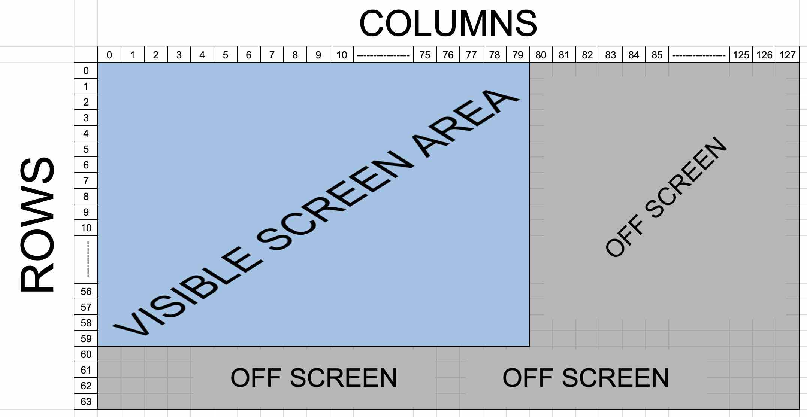
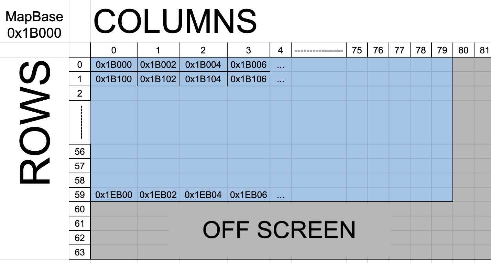

# MapBase
We learned in the last chapter about the TileBase section in VRAM and how tile images are constructed. We manipulated some tiles and saw them change on screen. The next question though is how does the CX16 know what tiles to show on the screen? How does it know what colors they are? When we looked at the bytes for the `@` character, there was only ON/OF info for each pixel. No color information, and certainly no information about where on the screen the tile should show. In some of the other Color Depth modes, you can encode color information into the tile images, but 1bpp mode is a little different. In all cases though, this is where the MapBase comes in.

The MapBase is a section of VRAM where we specify:
- The "index" of what tile to show on that screen location (or off screen as you will see)
- Additional display information about the tile like:
    - Foreground and background color (1bpp mode)
    - Palette info and vertical/horizontal flip (2/4/8 bpp mode)

## Visible vs. Hidden Tiles
As we learned in the last chapter, the 1bpp mode we start the emulator in shows 80x60 tiles on screen and each tile is 8x8 pixels. There are actually some "hidden" tiles off screen though because of powers of 2. Our mode is actually 128x64 tiles. There are an extra:
- 48 tiles off the right side of the screen at the end of each row
- 4 rows of tiles off the bottom of the screen.

You can't see these extra tiles but they still eat up memory. We don't have to worry about the extra bottom 4 rows because they sit at the end of the MapBase memory and we can mostly ignore them. The extra 48 tiles at the end of each row though, those we need to remember when we are drawing tiles to the screen. You will see why shortly.



## MapBase Address
With Layer 1 active, we use the `0x9F35 (L1_MAPBASE)` register to specify the VRAM address where our MapBase info will be stored. Much like the TileBase address from the previous chapter, we have a partial VRAM address. Here we have bits 16-9 of a 17 bit VRAM address. Bits 8-0 are defaulted to 0. This means we will align on a 512 byte boundary since the lowest bit we can change is bit 9. Again like the TileBase address, this is not a problem.

<table>
	<tbody>
    <tr>
		<th>Addr</th>
		<th>Name</th>
		<th>Bit&nbsp;7</th>
		<th>Bit&nbsp;6</th>
		<th>Bit&nbsp;5 </th>
		<th>Bit&nbsp;4</th>
		<th>Bit&nbsp;3 </th>
		<th>Bit&nbsp;2</th>
		<th>Bit&nbsp;1 </th>
		<th>Bit&nbsp;0</th>
	</tr>
    <tr>
		<td>0x9F35</td>
		<td>L1_MAPBASE</td>
		<td colspan="8" align="center">Map Base Address (16:9)</td>
	</tr>
    </tbody>
</table>

Let's look at an example. When the emulator starts, it has a value of `0b11011000`. Converting this to a 17 bit VRAM address:

- 17 bit addr = 0b`11011000` 000000000
- Broken up into 3 bytes = 1 10110000 00000000
- In hex this is `0x1B000`

## MapBase Data
Now that we know where in VRAM the MapBase address points to, what do we put there? What does MapBase data look like? The answer is, it depends on what Color Depth mode you are in. We are still working with Color Depth 0 (1 bpp) mode right now so let's look at that. We will dive into the other modes later.

The trusty [VERA Programmer's Reference](https://github.com/X16Community/x16-docs/blob/master/VERA%20Programmer's%20Reference.md#tile-mode-1-bpp-16-color-text-mode) has info on all of the display modes, but here is the info we need for 1bpp mode.
<table>
	<tr>
		<th>Offset</th>
		<th>Bit&nbsp;7</th>
		<th>Bit&nbsp;6</th>
		<th>Bit&nbsp;5</th>
		<th>Bit&nbsp;4</th>
		<th>Bit&nbsp;3</th>
		<th>Bit&nbsp;2</th>
		<th>Bit&nbsp;1</th>
		<th>Bit&nbsp;0</th>
	</tr>
	<tr>
		<td>0</td>
		<td align="center" colspan="8">Character index</td>
	</tr>
	<tr>
		<td>1</td>
		<td align="center" colspan="4">Background color</td>
		<td align="center" colspan="4">Foreground color</td>
	</tr>
</table>

You can see that we have :
- 1 byte (8 bit) "Character index". This is the index number, starting at 0, for which tile you want to be displayed. The first tile at the `TileBase` address is index 0, then 8 bytes after that is index 1, 8 bytes after that is index 2, etc.
- 1 byte split into 2 separate 4 bit sections for colors. 4 bits gives us the values 0-15 and specifies which of the palette colors 0-15 to use.

## Screen Location
Now we know how to make a 2 byte MapBase entry, how do we know where the tile will display on the screen (or off screen as we learned)?

The first 2 byte entry at the MapBase VRAM address is the `top left` corner of the screen (column 0, row 0). The next 2 byte entry moves to the `right` 1 tile (column 1, row 0). It keeps going like this for the first 128 tiles which is the entire row (column 127, row 0). The 129th memory entry drops to the next row and back to column 0 (column 0, row 1). Repeat this for all 128 columns and 64 rows. You can of course skip writing MapBase info for tiles that are off the screen, but make sure to adjust the VRAM address correctly to skip them. Later we will create a formula to calculate the VRAM address for a tile at position column X, row Y.


## Example
Let's say we want to put the `@` symbol in the first 40 tiles of row 0.

```C
#include <cx16.h>

void main() {
    unsigned long mapBaseAddr = 0x1B000;
    unsigned char i;

    VERA.address = mapBaseAddr;
    VERA.address_hi = mapBaseAddr>>16;

    // Set the Increment Mode, turn on bit 4
    VERA.address_hi |= 0b10000;

    // Write out 40 @ characters in the top row
    for (i=0; i<40; i++) {
        VERA.data0 = 0; // Index for the @ character
        
        // Color index 0 for background (black)
        // Color index 1 for foreground (white)
        VERA.data0 = 0b00000001; 
    }
}
```

Change the `VERA.data0 = 0;` to a different index value to see other characters from the PETSCII set. Change the `VERA.data0 = 0b00000001;` to different 4 bit color indexes to see different foreground/background colors.

Run `main.c` to see the entire screen filled with `@` symbols of different colors.


<!-- Extra styling info for some Markdown engines (e.g. VSCode) -->
<style>
table, th, td {
  border: 1px solid;
}
</style>