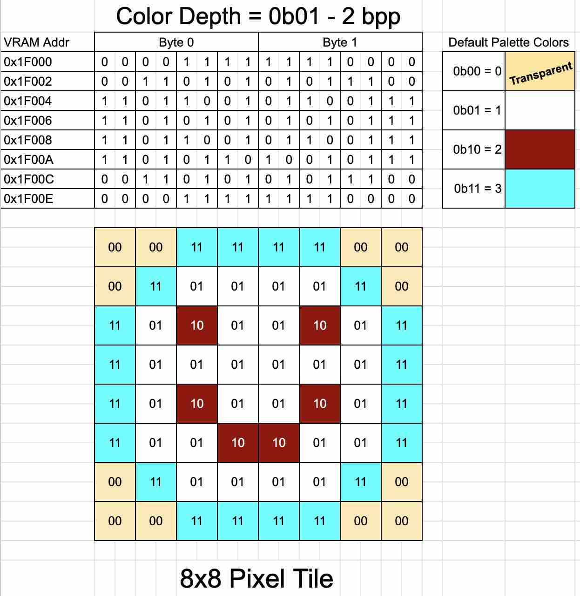
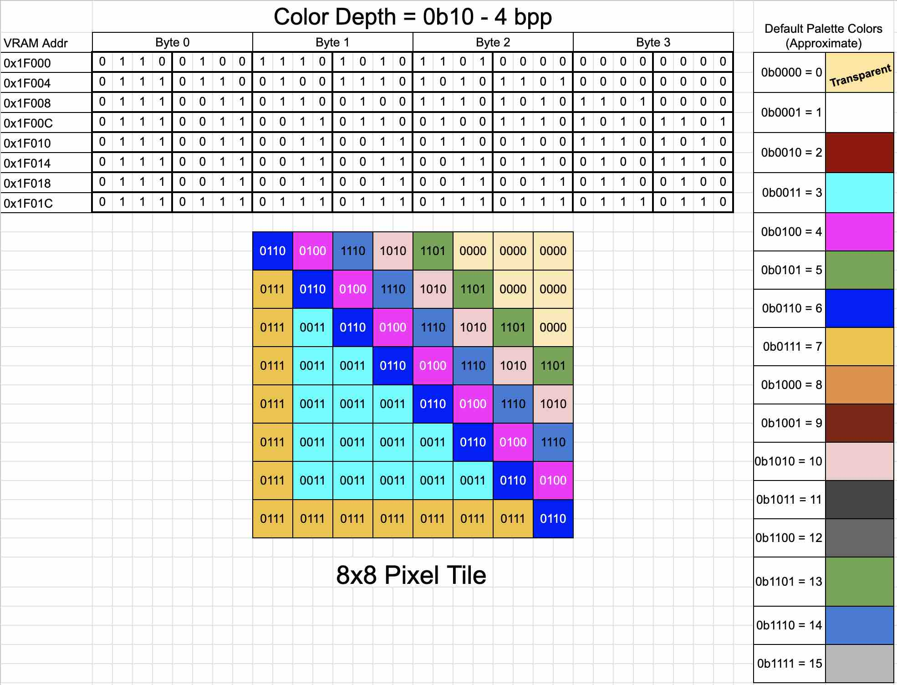
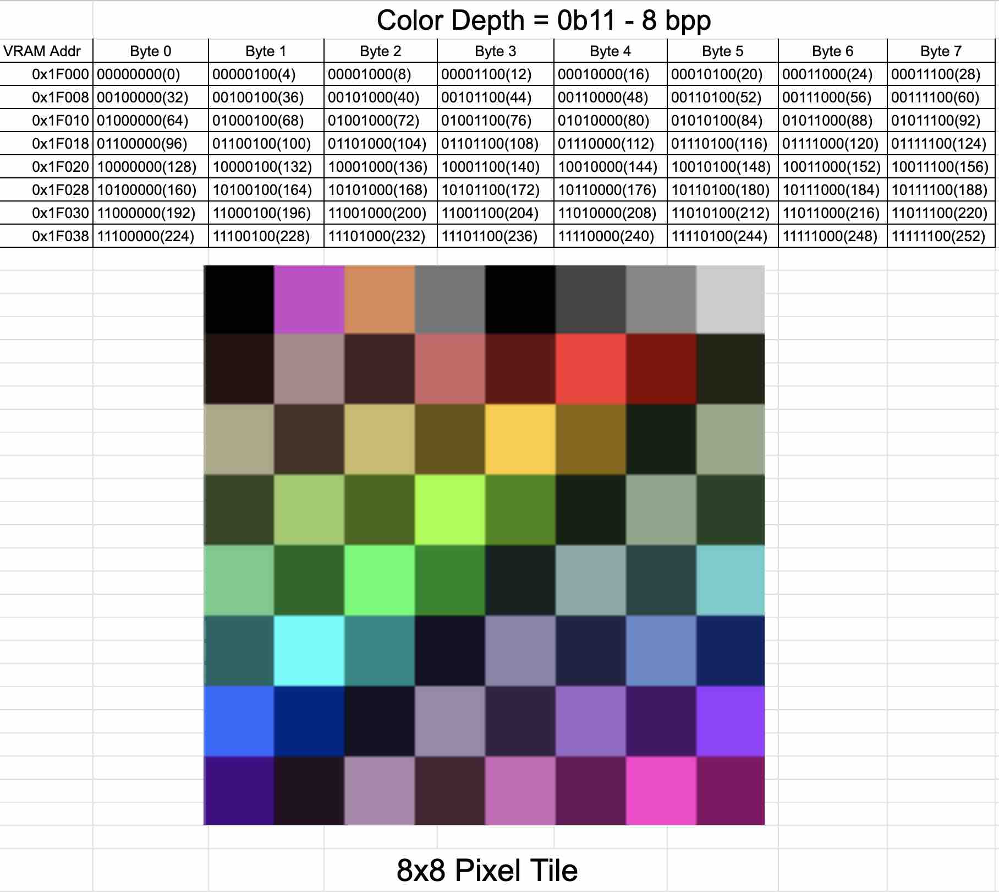

# Other Color Depth Modes
We've been talking about Color Depth mode 0 so far. This is 1 bpp (bit per pixel). This is the default mode when you start the emulator. This uses the minimum amount of video memory because each tile in the TileBase only uses 8 bytes. The down side though, is that you have limited color options. Depending on the `L1_CONFIG - T256C` bit, you either have a 16 color foreground/background, or a 256 color foreground only. This doesn't let you set colors for individual pixels. The color effects the entire tile. This mode is fine for text based programs, and perhaps some games that have limited requirements for colors on your tiles, but most games are going to want better pixel level color control.

<table>
<thead>
    <tr>
		<th>Addr</th>
		<th>Name</th>
		<th>Bit&nbsp;7</th>
		<th>Bit&nbsp;6</th>
		<th>Bit&nbsp;5 </th>
		<th>Bit&nbsp;4</th>
		<th>Bit&nbsp;3 </th>
		<th>Bit&nbsp;2</th>
		<th>Bit&nbsp;1 </th>
		<th>Bit&nbsp;0</th>
	</tr>
</thead>
<tbody>
	<tr>
		<td>0x9F34</td>
		<td>L1_CONFIG</td>
		<td colspan="2" align="center">Map Height</td>
		<td colspan="2" align="center">Map Width</td>
		<td colspan="1" align="center">T256C</td>
		<td colspan="1" align="center">Bitmap Mode</td>
		<td colspan="2" align="center">Color Depth</td>
	</tr>
</tbody>
</table>

## Color Depth Modes 2/4/8 bpp
We saw in a previous chapter that the `0x9F34 (L1_CONFIG) Color Depth bits (1-0)` has 4 modes that control the number of `bpp` for each tile pixel. With Color Depths 1-3, we have 2, 4, and 8 bpp.

<table>
<thead>
	<tr>
		<th align="right">Color Depth</th>
		<th>Description</th>
	</tr>
</thead>
<tbody>
	<tr>
		<td align="right">0</td>
		<td>1 bpp</td>
	</tr>
	<tr>
		<td align="right">1</td>
		<td>2 bpp</td>
	</tr>
	<tr>
		<td align="right">2</td>
		<td>4 bpp</td>
	</tr>
	<tr>
		<td align="right">3</td>
		<td>8 bpp</td>
	</tr>
</tbody>
</table>

In Color Depth 0 (1 bpp), a pixel was either on or off, now with multiple bpp we instead provide a Palette Index value. We learned about using palette colors in the MapBase chapter when we set colors for our 1 bpp tiles. With 1 bpp, the color information was encoded in the MapBase where you set the color for the entire tile. The TileBase tiles had no color information. In our new 2/4/8 bpp modes, its the opposite. The TileBase tiles WILL have color information for each pixel.

### Mode 1 - 2 bpp
To change the Color Depth to 2 bpp, OR the current value with `1`. This will set `bit 0` and enable 2 bpp:
```C
VERA.layer1.config |= 0b1;
```

If you run this, everything in the emulator will turn to black and green and look garbled. This makes sense because the tiles we have loaded are 1 bpp tiles, and suddenly VERA is reading them as 2 bpp tiles which has a totally different encoding (hence the garbling). We need to create some 2 bpp tiles and use those.

## Tiles in Mode 1 - 2 bpp
With 2 bpp, we have 4 values per pixel (2 bits = 4 possible values). These values (0-3) are palette indexes. This means we can use the first 4 colors of the palette. 

>Note that palette index 0 is `transparent`. This allows tiles (from layer 0) and sprites behind that pixel to show through.

2 bpp is kind of weird though because a byte has 8 bits. This means each byte has 4 pixels worth of information in it. So you end up setting pairs of bits inside these bytes for individual pixels. An example may help. Here is a 4 color smiley face tile:



You can see how each 2 bit pair controls 1 pixel. Tiles in this mode use 16 bytes. This is double what the 1 bpp mode used but you have more control over the colors.

## Tiles in Mode 2 - 4 bpp
With 4 bpp, we have 16 values per pixel (4 bits = 16 possible values). These values (0-15) are palette indexes for the first 16 colors of the palette. Color 0 is still transparent. Each byte in this mode covers 2 pixels (4 bits each). Each tile uses 32 bytes. Here is an example tile in 4 bpp mode:



## Tiles in Mode 3 - 8 bpp
With 8 bpp, we have full control over the color of every pixel in a tile. 8 bits lets us choose any of the 256 palette colors. The downside is that these tiles eat up more memory than the other modes. 8x8 tiles are 64 bytes each in this mode, but can give you some amazing looking tiles.

Here is an example of an 8 bpp tile that uses 64 different colors:



## MapBase for 2/4/8 bpp
The MapBase for these modes is a bit different than for 1 bpp. You still have a tile index, but you also have settings for palette offset, and vertical/horizontal flip.

<table>
	<tr>
		<th>Offset</th>
		<th>Bit&nbsp;7</th>
		<th>Bit&nbsp;6</th>
		<th>Bit&nbsp;5</th>
		<th>Bit&nbsp;4</th>
		<th>Bit&nbsp;3</th>
		<th>Bit&nbsp;2</th>
		<th>Bit&nbsp;1</th>
		<th>Bit&nbsp;0</th>
	</tr>
	<tr>
		<td>0</td>
		<td align="center" colspan="8">Tile index (7:0)</td>
	</tr>
	<tr>
		<td>1</td>
		<td align="center" colspan="4">Palette offset</td>
		<td align="center">V-flip</td>
		<td align="center">H-flip</td>
		<td align="center" colspan="2">Tile index (9:8)</td>
	</tr>
</table>

### Tile Index
You have 10 bits for the tile index in these modes. This lets you choose from up to 1024 different tiles. Most games won't need that many tiles but it allows you to create some very diverse foregrounds and backgrounds for your games. If your tile index is <= 255 (which it almost always will be), you can just assign the index to Byte 0:

```C
unsigned char i;
// Our default MapBase address
unsigned long mapBaseAddr = 0x1B000;

// Create your tiles here...

// Let's say you have a tile at index 13 you want to use
unsigned char myTileIndex = 13;

// Let's start at row 0, column 0 (the beginning of MapBase memory)
VERA.address = mapBaseAddr;
VERA.address_hi = mapBaseAddr>>16;
VERA.address_hi |= 0b10000; // Turn on increment mode of 1

// Put that tile in the first 10 columns
for (i=0; i<10; i++) {
	VERA.data0 = myTileIndex; // Assign the tile index

	// We don't need the palette offset, flip, and high bits for this tile
	// Just set them to 0
	VERA.data0 = 0; 
}
```

### Palette Offset
You have 4 bits (16 possible values) at your disposal to "slide" the colors of a tile down the palette. We learned that your tiles in these modes include color information in the form of palette/color indexes. If you have a value in the "Palette offset", it will increase all of the color indexes in a tile by a multiple of 16. For instance, let's say you are in 4 bpp mode and you have a tile that uses color indexes `1, 3, 4, and 9`. When you use that tile in your MapBase, and set the palette offset to `0b0001 (1)`, it will increase those color indexes by 16 to now be `17, 19, 20, and 25`. If you used a palette offset of `0b0010 (2)`, it would increase them by 32, etc.

### Why?
What? Why would you want to do this? Imagine you have some background tiles in your game and you are using color indexes that are bright colors for the daytime. When your game enters a nighttime cycle you want those background tiles to be darker. You could draw and load a new set of tiles with new colors, OR, with clever use of the palette, you could "shift" the tile colors using the palette offset to an area of the palette with darker colors. Fire and water levels can be done by shifting into palette sections that have more red or blue colors. This gives you huge reuse of your tiles.

There are also some "palette cycling" effects that can be achieve this way as well. You can give your tiles the appearance of animation by cycling through different colors. Water and lava effects are often done this way.

### Vertical and Horizontal Flip
Let's say you have a tile that is an arrow that points to the top right corner. You then realize that you also need arrows that point to the other 3 corners. You could draw 3 new tiles, OR, just use the V/H-Flip bits to flip the image of the tile around to the correct orientation in each location. 

## Example
We have 3 example programs that use everything we just learned about the 2/4/8 bpp modes. Each program demonstrates the following in a different color depth mode:
- Create an "arrow" tile using various colors in that mode
- Place some arrow tiles on the screen
- Use the V/H-Flip bits to point some of the arrows in different directions
- Use the Palette Offset to draw some arrows with different palette regions

To build them, run `make 2bpp`, `make 4bpp`, or `make 8bpp`.

To then run them, run `make run2bpp`, `make run4bpp`, or `make run8bpp`.

You an also build/run them manual as usual.

<style>
table, th, td {
  border: 1px solid;
}
</style>