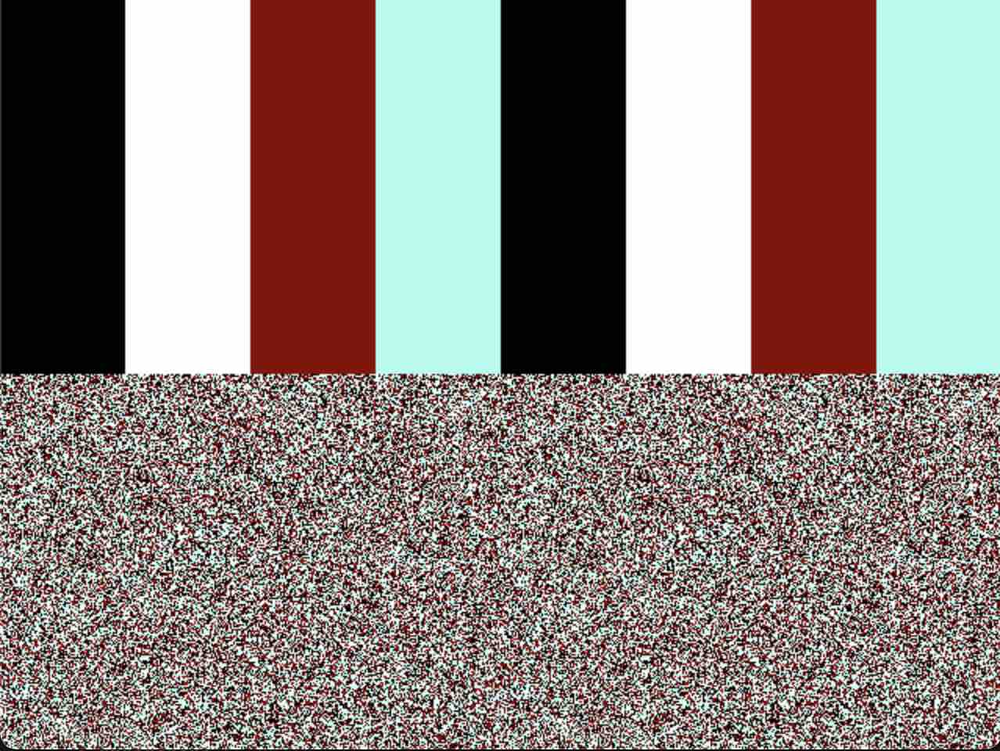

# Bitmap Mode
So far we've only been dealing with Tile Mode. This is the default mode when the CX16 starts and is the mode used by most games, but we also have Bitmap Mode. In this mode, rather than displaying tiles, it displays individual pixels that you control. Bitmaps are similiar to the tiles that you've created in previous chapters. You have 2/4/8 bpp modes, and you write out the bytes in VRAM at the TileBase address. Instead of creating individual tiles, you are just creating 1 giant tile for the entire screen. The rest is the same though. The 1st byte in memory is the top-left corner of the screen, and the last byte is the bottom right corner. There is no MapBase in this mode. VERA just displays directly from the TileBase VRAM in Bitmap mode.

## Resolutions
You have a choice of 2 resolutions. You can do the full 640x480 pixels, or you can go for a lower-resolution 320 pixel width. When using the lower resolution, we will make use of the `Active Display H-Scale / V-Scale` registers. The reason is because the CX16 always displays 640x480 pixels. If you choose the lower resolution, you will see that it will display the image on the left side of the screen and just duplciate it to the right. This is so it has something to display across the entire 640 width pixels. To mitigate this, the `H-Scale / V-Scale` registers can be used to display a smaller area of the display.

## Memory Size
Bitmaps eat up a lot of VRAM so you have to be aware of anything else you have stored in VRAM so you don't smash into it. You have 2 resolutions and 3 bpp modes for a total of 6 possibilities. Let's look at some sizes:

### 640x480
- 2 bpp (4 pixels per byte) = (640x480) / 4 = `76,800 bytes`
- 4 bpp (2 pixels per byte) = (640x480) / 2 = `153,600 bytes`
- 8 bpp (1 pixel per byte) = 640x480 = `307,200 bytes`

We have a total of 128k of VRAM which is `131,072 bytes`. A little bit of VRAM is eaten by the Palette, Sprite, and PSG registers registers so we really have `129,471 bytes` available to us. You can see that this is NOT ENOUGH to display 640x480 bitmaps at 4/8 bpp modes. You could display MOST of a 4 bpp bitmap or SOME of a 8 bpp bitmap at this resolution. You could also use the `H-Scale / V-Scale` to have it fill the screen.

### 320x240
- 2 bpp (4 pixels per byte) = (320x240) / 4 = `19,200 bytes`
- 4 bpp (2 pixels per byte) = (320x240) / 2 = `38,400 bytes`
- 8 bpp (1 pixel per byte) = 320x240 = `76,800 bytes`

This is much less VRAM and you can easily display full bitmaps in any of these modes.

## VRAM Address
If you look at the [Video Programming](https://github.com/X16Community/x16-docs/blob/master/X16%20Reference%20-%2008%20-%20Video%20Programming.md) docs for the CX16, you'll see the default VRAM address for the layer 1 TileBase of `0x1F000 Charset`. This is where the PETSCII character tiles are stored. In our code examples where we created new tiles we just kept this TileBase address and wrote over those characters. This was fine for creating a few tiles, but starting at `0x1F9C0` we have registers for sound, palette, and sprites. That only gives us 2,495 bytes before we crash into those. This is not nearly enough for any bitmap. 

The addresses/descriptions in this table are areas used by the CX16 KERNAL for certain functions. If you aren't using those functions, then you are free to do anything you want with VRAM addresses before `0x1F9C0` (which is where the sound registers start). We calculated this earlier as `129,471 bytes`. For our bitmap code examples, we will just use VRAM address `0x0`. When you start making games that have multiple tilesets and sprite, and both layers enabled each with its own MapBase, you will need to map out where everything will be stored in VRAM to make sure it all fits.

| Addresses     | Description                                               |
|---------------|-----------------------------------------------------------|
| 0x00000-0x12BFF | 320x240@256c Bitmap                                       |
| 0x12C00-0x12FFF | *unused*                                                  |
| 0x13000-0x1AFFF | Sprite Image Data (up to 0x1000 per sprite at 64x64 8-bit) |
| 0x1B000-0x1EBFF | Text Mode                                                 |
| 0x1EC00-0x1EFFF | *unused*                                                  |
| 0x1F000-0x1F7FF | Charset                                                   |
| 0x1F800-0x1F9BF | *unused*                                                  |
| 0x1F9C0-0x1F9FF | VERA PSG Registers (16 x 4 bytes)                         |
| 0x1FA00-0x1FBFF | VERA Color Palette (256 x 2 bytes)                        |
| 0x1FC00-0x1FFFF | VERA Sprite Attributes (128 x 8 bytes)                    |

## 320x240 Example
Take a look at `main-2-320.c`. It turns on 2 bpp, 320 pixel bitmap mode and writes out a 320x240 pixel image. The image is 4 columns, each one using one of the 4 colors. When you run it though, it won't look quite right. You will see 8 columns (instead of 4), and the bottom half of the screen will be random pixels. Run it with `make 2320` and then `make run2320`.



The problem is that we set the bitmap mode to 320 pixels, but we didn't adjust the display to show the smaller image. This is where the `H-Scale / V-Scale` registers come in.

To see the correct image, go into the code and uncomment these lines, then make and run the program again:
```C
    // VERA.display.hscale = 64;
    // VERA.display.vscale = 64;
```

## Active Display H-Scale / V-Scale
These registers will set the fractional scaling factor of the active part of the display. Setting this value to 128 (the default) will output 1 output pixel for every input pixel. Setting this to 64 will output 2 output pixels for every input pixel (essentially zooming in). Setting this to a value greater than 128 will output more than 2 output pixels for every input pixel (essentially zooming out).

<table>
	<tbody>
    <tr>
		<th>Addr</th>
		<th>Name</th>
		<th>Bit&nbsp;7</th>
		<th>Bit&nbsp;6</th>
		<th>Bit&nbsp;5 </th>
		<th>Bit&nbsp;4</th>
		<th>Bit&nbsp;3 </th>
		<th>Bit&nbsp;2</th>
		<th>Bit&nbsp;1 </th>
		<th>Bit&nbsp;0</th>
	</tr>
	<tr>
		<td>0x9F2A</td>
		<td>DC_HSCALE (DCSEL=0)</td>
		<td colspan="8" align="center">Active Display H-Scale</td>
	</tr>
	<tr>
		<td>0x9F2B</td>
		<td>DC_VSCALE (DCSEL=0)</td>
		<td colspan="8" align="center">Active Display V-Scale</td>
	</tr>
</tbody></table>

When we set the bitmap mode to 320 pixels, that just tells the hardware to draw into the first 320 pixels of each row. There are still 320 more pixels in each row on the screen though, so it just repeats the image. As the image is drawn further down the screen, it just keeps reading VRAM. Since we only drew a 320x240 image, it then picked up random bytes from VRAM after out image.

To fix this, we set the scale registers each to 64. That does a 2 to 1 ratio, meaning each of the pixels in our image will take up 2 vertical, and 2 horizontal pixels. So now our 320x240 image fills the screen.

### Confused?
You can mostly think of them as zoom controls. For your games, if you are using 640x480, then you will have the scale registers set to 128 (which is the default). If you are using 320x240, you will set them to 64. That's about all you need to know. You can use these registers to achieve some cool zooming effects, and camera shakes, but for the most part its just one of those 2 values.

## 640x480 Example
Take a look at `main-2-640.c` to see an example of a 2 bpp, 640x480 bitmap. I'm displaying 8 columns with some solid and mixed colors, but the code is largely the same. The main differences are:
- We enable 640 pixel width mode on the TileBase register
- We don't need to adjust the `H-Scale / V-Scale` registers since we are displaying a "full resolution" 640x480 bitmap.

## 4 and 8 bpp Examples
### 320x240
Take a look at `main-4-320.c` and `main-8-320.c` for 4 and 8 bpp bitmap examples. The 8 bpp mode gives us access to all 256 colors. The code displays 1 color per line so it only gets through 240 colors, but you'll see quite the rainbow. Build/run these to see some higher color bitmaps.

### 640x480
As we learned earlier, there is not enough VRAM to display FULL 4/8 bpp bitmaps in 640x480 mode. `main-4-640.c` attempts to do it, but if you build/run it, you'll see that it makes it around 3/4 of the way through the image before you start seeing garbage.

<style>
table, th, td {
  border: 1px solid;
}
</style>